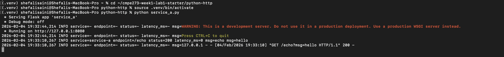
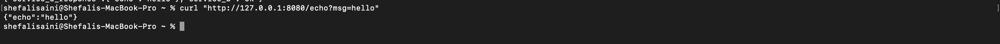
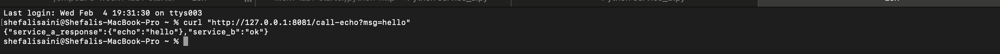
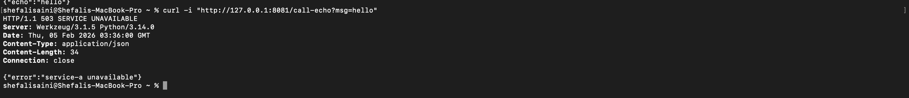

# CMPE 273 – Week 1 Lab 1: Your First Distributed System

---

## Lab Goal
Build a locally distributed system with two independent services that communicate over the network, include basic logging, and demonstrate independent failure.

---

### Service A (Echo API) — Port 8080
Endpoints:
- `GET /health` → `{"status":"ok"}`
- `GET /echo?msg=hello` → `{"echo":"hello"}`

### Service B (Client Service) — Port 8081
Endpoints:
- `GET /health` → `{"status":"ok"}`
- `GET /call-echo?msg=hello`
  - Calls Service A `/echo`
  - Uses a timeout when calling Service A
  - Returns HTTP **503** if Service A is unavailable
  - Logs request details and errors

---

## How to Run Locally (Python)

### Prerequisites
- Python 3.10+
- Git

### Setup
```bash
git clone https://github.com/ShefaliSaini1204/cmpe273-week1-lab1
cd cmpe273-week1-lab1/python-http
python3 -m venv .venv
source .venv/bin/activate
pip install flask requests
```

## Proof

### Service A Running


### Service B Running


### Success Case (Service A)


### Success Case (Service B)


### Failure Case (Service A Stopped)


## What Makes This Distributed?

This system is distributed because it consists of two independent services running as separate processes that communicate over the network using HTTP. Each service has its own lifecycle: Service B continues running even when Service A is stopped and must handle partial failures using timeouts and error handling. Logging and failure isolation demonstrate core distributed system characteristics.
